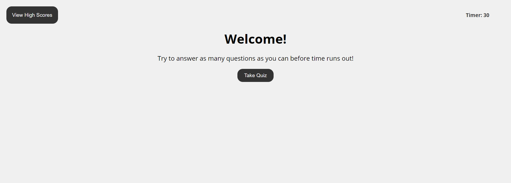
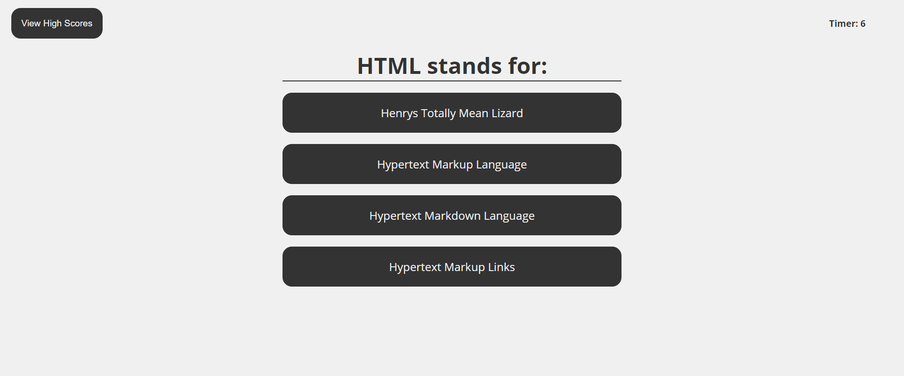
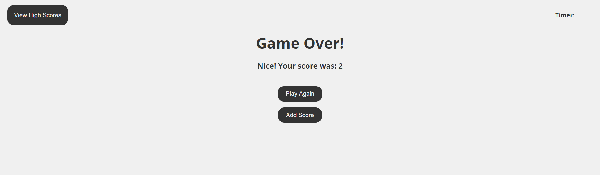
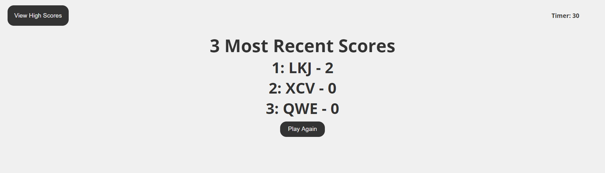

# Code-Quiz

# DEPLOYED APP
https://ryand67.github.io/Code-Quiz/

# ABOUT
In this project I created an app that quizzes the user on common web development topics and ideas.

You get 30 seconds to answer as many questions as possible, the question's order is randomly selected, and for every question answered correctly you get a point, for every question missed 5 seconds comes off the clock.  At the end you can choose to store your initials and score locally so that you can go back and look at the last 3 most recent scores. Pages (except the welcome) are created dynamically through JavaScript.  Everything styled by me and CSS3.

# SCRENSHOTS

